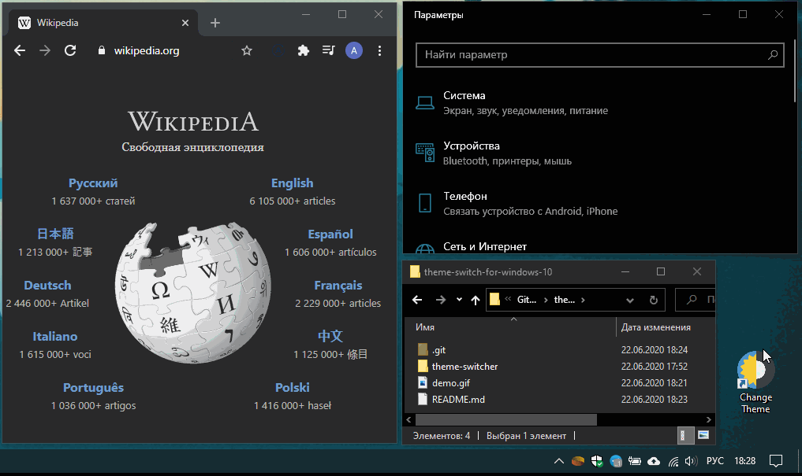

# Theme switch for Windows 10

**This works on the latest versions of windows 10 where there is a light and dark theme.**

A simple script on the WScript that switches the system color theme by simply running the script.
This was created to simplify the process of changing themes and avoid going into settings.

### How am I doing:
* I put the folder with the script and the icon on the hard drive.
* After I create a link on the desktop that points to the script file and change the link icon.

🎉 Done! I have a button to quickly change the system theme.

### P.S.
Also, to change the theme in Google Chrome, I use the Dark Reader extension where the option to use the system color scheme is enabled.
